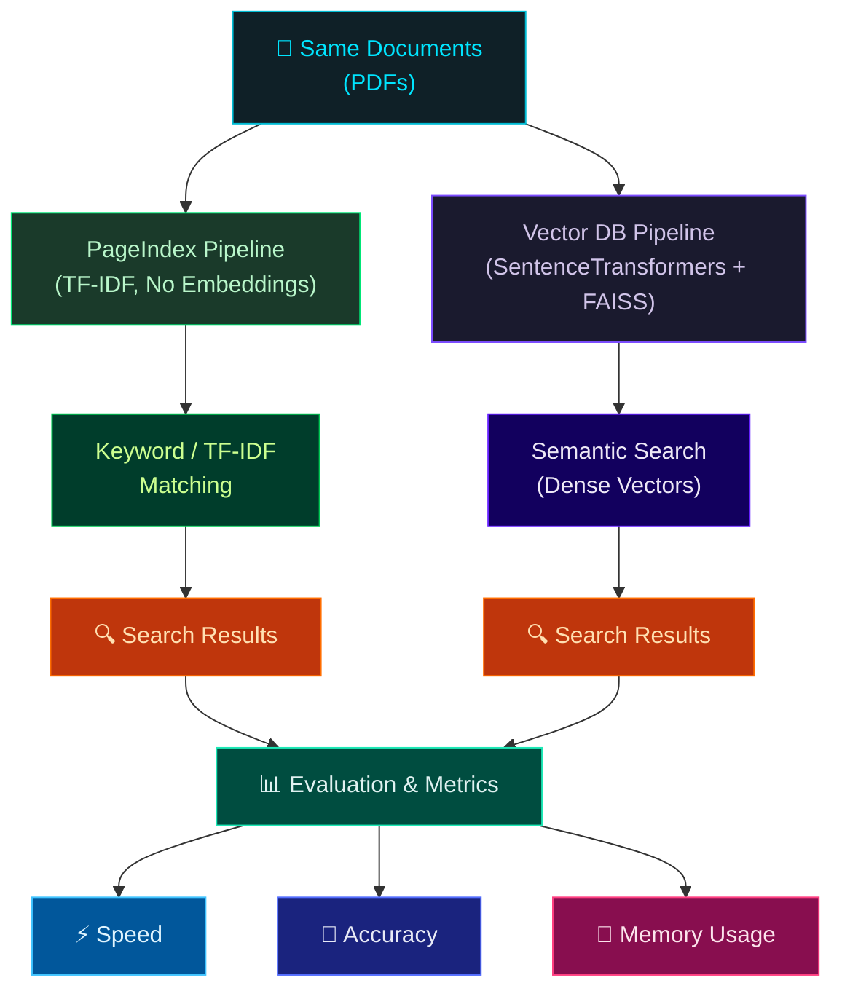

# Vector DB vs PageIndex Comparison System

> Built a document retrieval benchmark comparing vector-based search (FAISS + SentenceTransformers) and PageIndex-based search (TF-IDF) across speed, accuracy, and memory usage.

## Why This Matters

Not every retrieval problem needs a vector database. This project provides empirical evidence for choosing the right retrieval strategy by benchmarking:

- **PageIndex (TF-IDF)** — lexical, no embeddings, lightweight
- **Vector DB (FAISS)** — semantic, embedding-based, resource-heavy

## Architecture



## Metrics Compared

| Metric              | PageIndex (TF-IDF) | Vector DB (FAISS) |
| ------------------- | ------------------ | ----------------- |
| Index build time    | ✅ Fast             | ❌ Slow (embeddings) |
| Query latency       | ✅ Sub-ms           | ❌ ~50-100ms         |
| Memory usage        | ✅ Low              | ❌ High              |
| Exact keyword match | ✅ Strong           | ⚠️ Weaker           |
| Semantic similarity | ❌ None             | ✅ Strong            |
| Explainability      | ✅ TF-IDF scores    | ❌ Opaque            |

## Quick Start

### 1. Install Dependencies

```bash
python -m venv venv
source venv/bin/activate  # Windows: venv\Scripts\activate
pip install -r requirements.txt
```

### 2. Add Documents

Place **10–30 PDF files** in `data/docs/`:

```bash
data/docs/
├── ml_notes.pdf
├── research_paper.pdf
└── documentation.pdf
```

Or generate sample PDFs for testing:

```bash
python generate_sample_pdfs.py
```

### 3. Configure Queries

Edit `data/queries.json` with queries and ground-truth relevant pages:

```json
[
  {
    "query": "data preprocessing steps",
    "relevant_pages": [3, 4],
    "doc": "sample"
  }
]
```

### 4. Run the Benchmark

```bash
python main.py
```

With custom options:

```bash
python main.py --docs data/docs --top-k 10 --runs 30 --output results.csv
```

## Project Structure

```
├── data/
│   ├── docs/                  # PDF documents
│   └── queries.json           # Ground-truth queries
├── pageindex_pipeline/
│   ├── __init__.py
│   ├── index.py               # TF-IDF index builder
│   └── search.py              # Keyword/TF-IDF search
├── vector_pipeline/
│   ├── __init__.py
│   ├── embed.py               # SentenceTransformer embeddings
│   ├── index.py               # FAISS index builder
│   └── search.py              # Semantic search
├── evaluation/
│   ├── __init__.py
│   ├── speed.py               # Latency benchmarking
│   ├── memory.py              # RSS memory profiling
│   └── accuracy.py            # Recall@K, Precision@K, MRR
├── main.py                    # Orchestrator — runs full comparison
├── generate_sample_pdfs.py    # Creates test PDFs
├── requirements.txt
└── README.md
```

## Sample Output

```
============================================================
  FINAL COMPARISON
============================================================
           build_time_sec  avg_latency_ms  p95_latency_ms  recall@5  precision@5    mrr  memory_mb
PageIndex          0.0234           0.450           0.820    0.7200       0.1440  0.6500      12.34
VectorDB           4.5612          52.340          68.120    0.8900       0.1780  0.8200     310.50
```

## How Evaluation Works

### Speed
- **Index build time**: Wall-clock time to construct the index
- **Query latency**: Average over 20 runs per query (3 warm-up runs discarded)
- **P95 latency**: 95th percentile query time

### Memory
- RSS (Resident Set Size) measured via `psutil` at key pipeline stages
- Delta from baseline reported for fair comparison

### Accuracy
- **Recall@K**: Fraction of relevant pages found in top-K results
- **Precision@K**: Fraction of top-K results that are relevant
- **MRR**: Mean Reciprocal Rank of first relevant result

## Tech Stack

| Component      | Technology                    |
| -------------- | ----------------------------- |
| Language       | Python 3.10+                  |
| PageIndex      | scikit-learn TfidfVectorizer  |
| Vector DB      | FAISS (faiss-cpu)             |
| Embeddings     | SentenceTransformers (all-MiniLM-L6-v2) |
| PDF Parsing    | PyMuPDF (fitz)                |
| Profiling      | psutil, time (perf_counter)   |
| Analysis       | pandas, numpy                 |

## Key Insight

> "PageIndex outperformed vector search in latency and memory efficiency, while vector DBs provided better semantic recall. This shows that vector databases are not always the optimal solution, especially for keyword-heavy or constrained environments."

## CLI Options

| Flag         | Default          | Description                       |
| ------------ | ---------------- | --------------------------------- |
| `--docs`     | `data/docs`      | Directory containing PDF files    |
| `--queries`  | `data/queries.json` | Path to evaluation queries     |
| `--top-k`    | `5`              | Number of results to retrieve     |
| `--runs`     | `20`             | Timed runs per query              |
| `--output`   | `results.csv`    | Output CSV file path              |

## License

MIT
